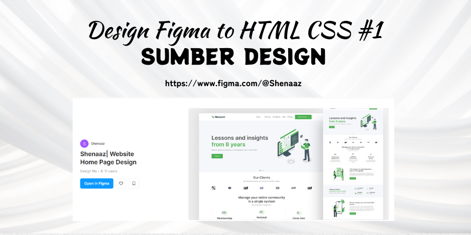

Belajar Mentranslatekan Design Figma - HTML CSS #1
Tujuan dari repository ini adalah untuk meningkatkan kemampuan frontend saya, khususnya dalam membuat halaman web yang responsif dan rapi berdasarkan desain yang sudah ada."

Poin Utama:

Proyek latihan menerjemahkan desain Figma ke HTML dan CSS.
Fokus pada belajar membuat layout responsif.
Bagian dari perjalanan meningkatkan keterampilan frontend.

